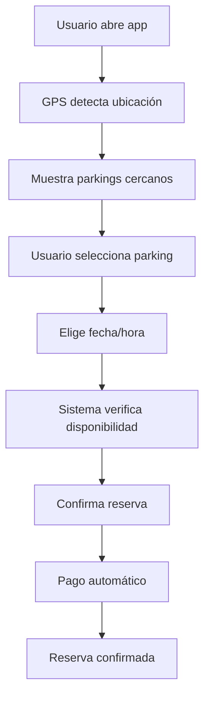
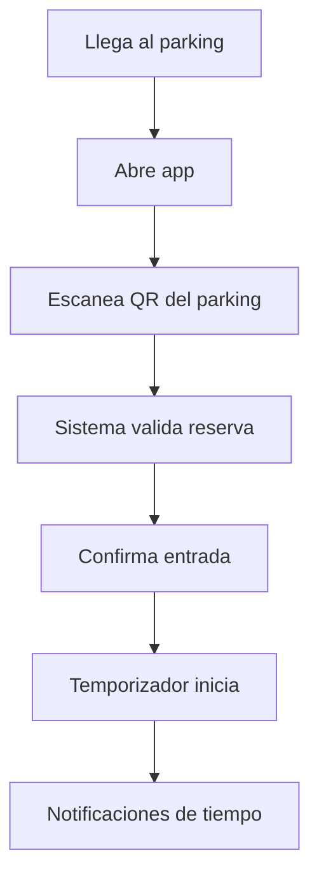
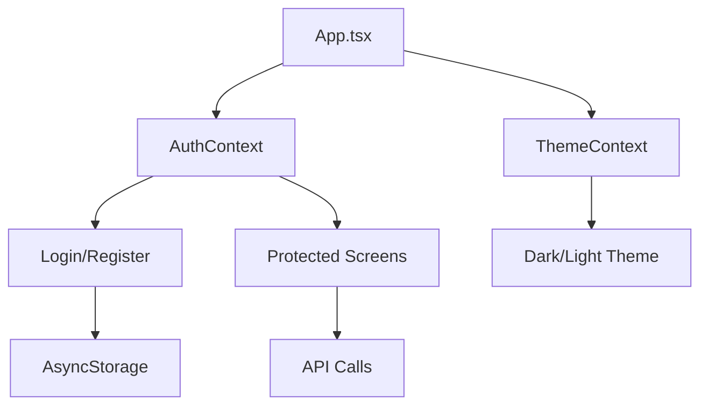

# 📱 Parking Management System - Mobile App

<div align="center">


[](https://opensource.org/licenses/MIT)
[](http://makeapullrequest.com)
[](https://github.com/dariverap/parking-system-mobile/stargazers)

*🚗 App móvil nativa para reserva y gestión de estacionamientos*

[📖 Documentación](#-documentación) • [🚀 Instalación](#-instalación) • [📱 Características](#-características) • [🤝 Contribuir](#-cómo-contribuir)

</div>

---

## 📋 Descripción del Proyecto

**Parking Management System - Mobile App** es la aplicación móvil del ecosistema de gestión de estacionamientos desarrollado para el curso de **Curso Integrador II: Sistemas** de la **UTP**. Desarrollada con React Native y Expo, ofrece una experiencia nativa en iOS y Android para la reserva y gestión de espacios de estacionamiento.

Esta app forma parte del sistema completo **Parking Management System**:
- 📱 **Mobile App** (este proyecto) - App para usuarios finales
- 🖥️ **Frontend Web** - Panel de administración web
- 🔧 **Backend API** - API RESTful

### 🎯 ¿Qué puedes hacer con Parking Management System Mobile?

- 🔍 **Buscar Parkings**: Encuentra estacionamientos cercanos con mapas
- 📅 **Reservar Espacios**: Reserva espacios por tiempo determinado
- 🚗 **Check-in/out**: Confirma llegada y salida con QR codes
- 💳 **Pagos Móviles**: Paga directamente desde la app
- 🔔 **Notificaciones**: Recibe alertas de reservas y recordatorios
- 👤 **Perfil Personal**: Gestiona tus vehículos y preferencias
- 📍 **GPS Integration**: Localización en tiempo real

---

## 🎓 Información del Proyecto

**🏫 Universidad**: Universidad Tecnológica del Perú (UTP)  
**� Carrera**: Ingeniería de Sistemas  
**� Curso**: Curso Integrador II: Sistemas  
**👨‍🏫 Profesora**: CLAUDIA YOLANDA VILLALTA FLORES  
**📅 Año**: 2025  
**👥 Equipo**: Estudiantes de Ingeniería de Sistemas  

Este proyecto es parte del portafolio académico desarrollado durante el curso de **Curso Integrador II: Sistemas**, demostrando la aplicación práctica de conceptos aprendidos en desarrollo móvil, React Native, APIs RESTful y experiencia de usuario móvil.

---

## ✨ Características Principales

<div align="center">

| 📱 **Nativo** | 🗺️ **Maps** | 💳 **Pagos** | 🔐 **Seguro** |
|:---:|:---:|:---:|:---:|
| iOS & Android | GPS + Mapas | Móviles | Biometric Auth |
| Offline Mode | Real-time | Integraciones | JWT Tokens |
| Push Notifications | Directions | Recibos | Encrypted Data |

</div>

### 🔧 Tech Stack

- **Framework**: React Native 0.72+
- **Platform**: Expo (SDK 49+)
- **Language**: TypeScript
- **Navigation**: React Navigation v6
- **State Management**: Context API + AsyncStorage
- **Maps**: React Native Maps + Google Maps
- **HTTP Client**: Axios con interceptores
- **UI Components**: React Native Paper / Custom
- **Notifications**: Expo Notifications
- **Camera**: Expo Camera (QR codes)
- **Payments**: Stripe React Native (futuro)

---

## 🚀 Instalación y Configuración

### 📋 Prerrequisitos

- Node.js >= 18.0.0
- Expo CLI: `npm install -g @expo/cli`
- iOS Simulator (macOS) o Android Studio (Windows/Linux)
- Cuenta en [Expo](https://expo.dev) (opcional)

### ⚡ Instalación Rápida

```bash
# 1. Clonar el repositorio
git clone https://github.com/dariverap/front-movil-parking.git
cd front-movil-parking

# 2. Instalar dependencias
npm install

# 3. Configurar variables de entorno
cp .env.example .env

# 4. Editar .env con tus valores
EXPO_PUBLIC_API_URL=https://api.parkly.com
EXPO_PUBLIC_MAPS_API_KEY=tu_google_maps_key

# 5. Iniciar el proyecto
npm start
# o
expo start
```

### 🔧 Variables de Entorno

Crea un archivo `.env` en la raíz del proyecto:

```env
# API Configuration
EXPO_PUBLIC_API_URL=https://api.parkly.com/api
EXPO_PUBLIC_ENVIRONMENT=development

# Maps & Location
EXPO_PUBLIC_GOOGLE_MAPS_API_KEY=tu_clave_de_google_maps
EXPO_PUBLIC_MAPS_PROVIDER=google

# Payments (futuro)
EXPO_PUBLIC_STRIPE_PUBLISHABLE_KEY=pk_test_...

# App Configuration
EXPO_PUBLIC_APP_NAME=Parkly Mobile
EXPO_PUBLIC_VERSION=1.0.0
```

### 📱 Ejecutar en Dispositivos

```bash
# Iniciar Expo Dev Server
npm start
# o
expo start

# Opciones disponibles:
# - Presiona 'i' para iOS Simulator
# - Presiona 'a' para Android Emulator
# - Escanea QR con Expo Go app
# - Presiona 'w' para web (limitado)
```

### 🏗️ Build para Producción

```bash
# Build para EAS (Expo Application Services)
npm install -g @expo/cli
expo login
eas build --platform ios
eas build --platform android

# O build local (avanzado)
expo build:ios
expo build:android
```

---

## 📱 Características de la App

### 🏠 Pantallas Principales

| Pantalla | Descripción | Funcionalidad |
|:---:|:---:|:---:|
| **🏠 Home** | Dashboard principal | Mapa + parkings cercanos |
| **🔍 Buscar** | Búsqueda de parkings | Filtros por precio, distancia |
| **📅 Reservas** | Mis reservas | Historial y reservas activas |
| **🚗 Vehículos** | Mis autos | Gestión de flota personal |
| **👤 Perfil** | Configuración | Datos personales y pagos |

### 🎯 Flujos de Usuario

#### 📍 **Reservar un Espacio**


#### 🚗 **Check-in en Parking**


---

## 🏗️ Arquitectura de la App

### 📁 Estructura del Proyecto

```
front-movil/
├── src/
│   ├── components/        # Componentes reutilizables
│   │   ├── common/       # UI base (Button, Input, etc.)
│   │   ├── maps/         # MapView, Markers
│   │   ├── booking/      # Reserva flow
│   │   └── profile/      # Perfil y settings
│   ├── screens/          # Pantallas principales
│   │   ├── HomeScreen.tsx
│   │   ├── SearchScreen.tsx
│   │   ├── BookingScreen.tsx
│   │   └── ProfileScreen.tsx
│   ├── navigation/       # Configuración de navegación
│   │   ├── AppNavigator.tsx
│   │   └── AuthNavigator.tsx
│   ├── services/         # APIs y servicios externos
│   │   ├── api.ts       # Cliente HTTP
│   │   ├── auth.ts      # Autenticación
│   │   ├── maps.ts      # Google Maps
│   │   └── payments.ts  # Stripe/Pagos
│   ├── utils/           # Utilidades
│   │   ├── constants.ts
│   │   ├── helpers.ts
│   │   └── validators.ts
│   ├── hooks/           # Custom hooks
│   │   ├── useLocation.ts
│   │   ├── useAuth.ts
│   │   └── useBookings.ts
│   ├── contexts/        # React Context
│   │   ├── AuthContext.tsx
│   │   └── ThemeContext.tsx
│   └── types/           # TypeScript types
├── assets/              # Imágenes, iconos, fonts
├── constants/           # Config constantes
└── App.tsx             # Punto de entrada
```

### 🔄 Estado Global



---

## 🔐 Permisos Requeridos

### 📍 **Ubicación (GPS)**
- **Uso**: Encontrar parkings cercanos y navegación
- **Permiso**: `LOCATION` (foreground + background)
- **iOS**: `NSLocationWhenInUseUsageDescription`
- **Android**: `ACCESS_FINE_LOCATION`

### 📷 **Cámara**
- **Uso**: Escanear QR codes para check-in/out
- **Permiso**: `CAMERA`
- **iOS**: `NSCameraUsageDescription`
- **Android**: `CAMERA`

### 🔔 **Notificaciones**
- **Uso**: Recordatorios de reservas y alertas
- **Permiso**: `NOTIFICATIONS`
- **iOS**: `UNUserNotificationCenter`
- **Android**: `POST_NOTIFICATIONS`

### 💳 **Pagos (Futuro)**
- **Uso**: Procesar pagos móviles
- **Permiso**: Biometric authentication
- **iOS**: `NSFaceIDUsageDescription`
- **Android**: `USE_BIOMETRIC`

---

## 🧪 Testing y Calidad

### 🏃‍♂️ Ejecutar Tests

```bash
# Tests unitarios
npm test

# Tests con coverage
npm run test:coverage

# Tests E2E (con Detox)
npm run test:e2e
```

### 📱 Testing en Dispositivos

```bash
# iOS Simulator
npm run ios

# Android Emulator
npm run android

# Dispositivo físico
npm run ios:device
npm run android:device
```

---

## 🤝 Cómo Contribuir

¡Las contribuciones son bienvenidas! 🎉

### 📝 Proceso de Contribución

1. **Fork** el proyecto
2. **Crea** una rama (`git checkout -b feature/AmazingFeature`)
3. **Desarrolla** con TypeScript estricto
4. **Testea** en iOS y Android
5. **Commit** (`git commit -m 'Add AmazingFeature'`)
6. **Push** (`git push origin feature/AmazingFeature`)
7. **Pull Request** detallado

### 🐛 Reportar Bugs

Para reportar bugs en móviles:

1. Ve a [Issues](https://github.com/dariverap/front-movil-parking/issues)
2. Usa template "Bug Report - Mobile"
3. Incluye:
   - Dispositivo y OS versión
   - Screenshots/videos
   - Steps to reproduce
   - Logs de Expo/Metro

### 📱 Guías de Desarrollo

- ✅ **TypeScript** obligatorio
- ✅ **ESLint** + **Prettier**
- ✅ **React Navigation** patterns
- ✅ **Responsive design** principles
- ✅ **Offline-first** approach
- ✅ **Accessibility** (a11y)

---

## 👥 Colaboradores

<div align="center">

| [<br><sub><b>Diego Rivera</b></sub>](https://github.com/dariverap)<br><sub>🚀 Mobile Architect & Lead Developer</sub> | [<br><sub><b>Estudiante UTP</b></sub>](https://github.com/utp-student)<br><sub>🤝 Mobile Developer</sub> |
|:---:|:---:|

**Proyecto desarrollado como parte del curso Curso Integrador II: Sistemas - UTP**

</div>

---

## 📄 Licencia

Este proyecto está bajo la Licencia MIT - ver el archivo [LICENSE](LICENSE) para más detalles.

[](https://opensource.org/licenses/MIT)

---

## 🙋‍♂️ FAQ

### ❓ ¿Cómo configuro Google Maps?
1. Crea proyecto en [Google Cloud Console](https://console.cloud.google.com)
2. Habilita Maps SDK for iOS/Android
3. Crea API Key con restricciones
4. Agrega al `.env`: `EXPO_PUBLIC_GOOGLE_MAPS_API_KEY=tu_key`

### ❓ ¿Puedo usar Apple Maps en iOS?
Sí, configura `EXPO_PUBLIC_MAPS_PROVIDER=apple` en iOS.

### ❓ ¿Cómo pruebo notificaciones?
Usa `expo-notifications` en desarrollo o Expo Go app.

### ❓ ¿Es compatible con tablets?
Sí, diseño responsive para diferentes tamaños de pantalla.

### ❓ ¿Offline mode funciona?
Parcialmente - algunas features requieren conexión a internet.

---

## 🚀 Roadmap

- [ ] 💳 **Integración de Pagos**: Stripe/PayPal
- [ ] 🔔 **Push Notifications**: Avanzadas
- [ ] 📍 **Navegación GPS**: Turn-by-turn
- [ ] 🎫 **Tickets Digitales**: QR codes
- [ ] 👥 **Invitar Amigos**: Compartir parkings
- [ ] 📊 **Analytics**: Uso y comportamiento
- [ ] 🌍 **Multi-idioma**: i18n
- [ ] 🎨 **Themes**: Personalización
- [ ] 🔄 **Offline Sync**: Sincronización
- [ ] 🏆 **Loyalty Program**: Puntos y recompensas

---

## 📞 Soporte Académico

- 📧 **Email**: diego.rivera@utp.edu.pe
- 💬 **Issues**: [GitHub Issues](https://github.com/dariverap/parking-system-mobile/issues)
- 📚 **Universidad**: Universidad Tecnológica del Perú (UTP)
- 📖 **Curso**: Curso Integrador II: Sistemas
- 👨‍🏫 **Profesora**: CLAUDIA YOLANDA VILLALTA FLORES

---

## 🏆 Badges y Reconocimientos

<div align="center">

[](https://reactnative.dev/)
[](https://expo.dev/)
[](https://www.typescriptlang.org/)

</div>

---

<div align="center">

**Proyecto académico desarrollado con ❤️ para el curso Curso Integrador II: Sistemas - UTP**

⭐ ¡Gracias por revisar nuestro proyecto!

[⬆️ Volver al inicio](#-parking-management-system---mobile-app)

</div>
